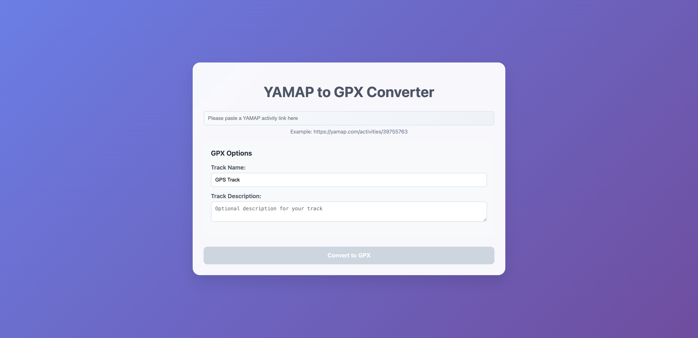

# Goal
Convert YAMAP activity data into a GPX file for use in other GPS apps.

# Why I Made This
I built this project while planning a hiking trip to Nikko, Japan in May 2025. YAMAP is a great app, but downloading GPX files from public activities requires a subscription, which makes sense, but isn’t ideal if you’re just visiting Japan for a few days.

# Disclaimer
This tool is just for personal use.

# Getting Started
1. Clone the repository
2. Run `npm install` to install the dependencies
3. Run `npm start` to start the development server
4. Open `http://localhost:3000` in your browser 

